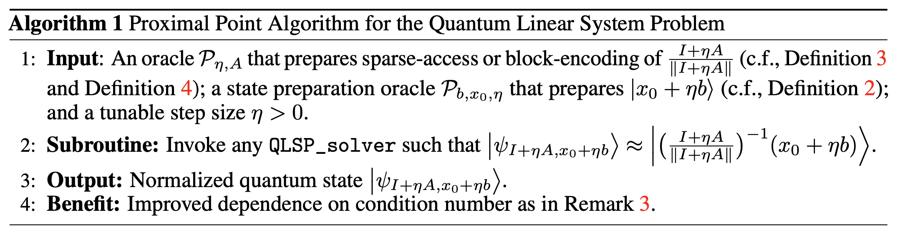
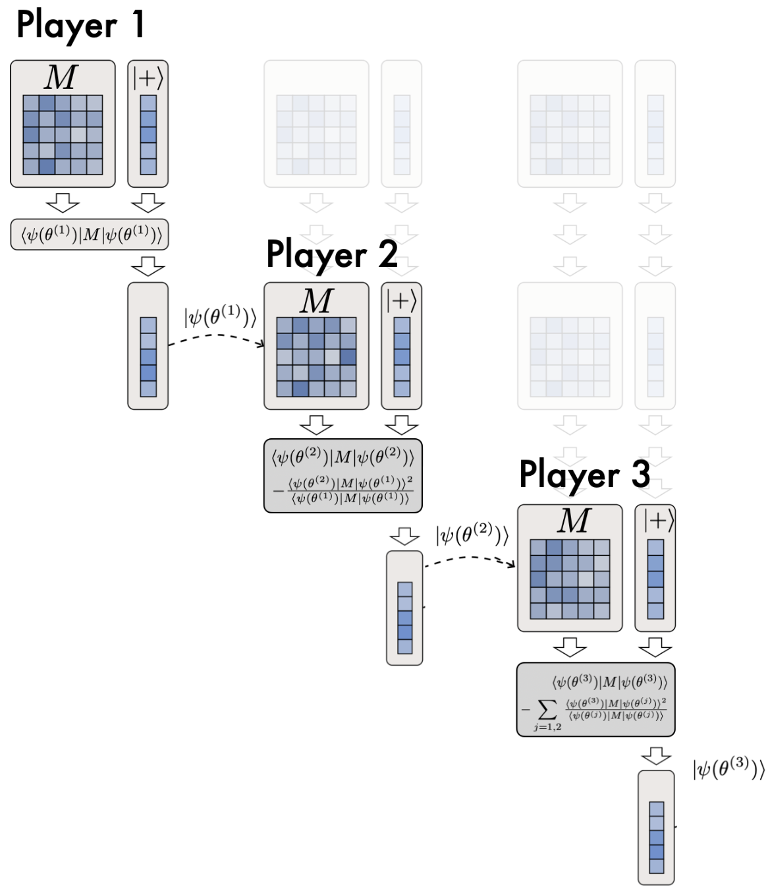
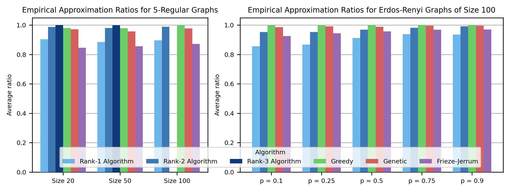

### Blogposts

<ul class="blog-list">

  <li>
    

      
        
      
      
        <a href="./QLSP_PPA.html">A Catalyst Framework for the Quantum Linear System Problem via the Proximal Point Algorithm</a>
        A classical-acceleration recipe — the proximal point algorithm — applied to quantum linear-system solvers.
      
    

  </li>

  <li>
    

      
        
      
      
        <a href="./QuantumEigenGame.html">Quantum EigenGame for Excited-State Calculation</a>
        A game-theoretic decomposition of eigenvalue problems for quantum simulation of excited states.
      
    

  </li>

  <li>
    

      
        
      
      
        <a href="./MaxKCut.html">Exploiting Low-Rank Structure in Max-K-Cut Problems</a>
        Algorithm overview, theoretical guarantees, and benchmarks for low-rank Max-3-Cut at scale.
      
    

    <ul class="sublist">
      <li>
        🖥️
        
          <a href="./LowRankMaxCut_GPU.html">What Can 15 Obsolete GPUs Do for Combinatorial Optimization?</a>
          GPU implementation, scaling experiments, interactive visualisations.
        
      </li>
      <li>
        🧱
        
          <a href="./LowRankMaxCut_Rank1.html">Rank-1 as a Building Block for Million-Node Max-3-Cut</a>
          Incremental scoring, hybrid warm-starts, and extreme-scale experiments.
        
      </li>
      <li>
        🎲
        
          <a href="./LowRankMaxCut_RandR2.html">Randomized Rank-2: When Two Eigenvectors Beat One</a>
          A 3-phase pipeline that beats SA on 6 of 12 graph families with constant sample complexity.
        
      </li>
      <li>
        🔀
        
          <a href="./LowRankMaxCut_DSatur.html">Spectral vs. Combinatorial: Two Views of Graph Structure</a>
          A DSatur + spectral ensemble that beats SA on 11 of 13 graph families.
        
      </li>
    </ul>
  </li>

</ul>
